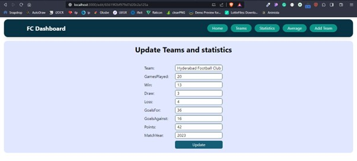
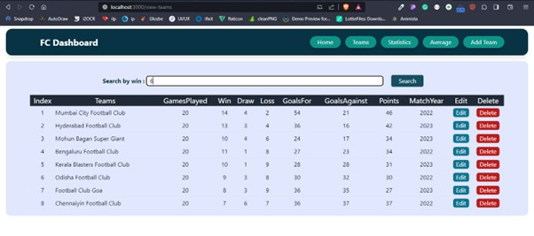
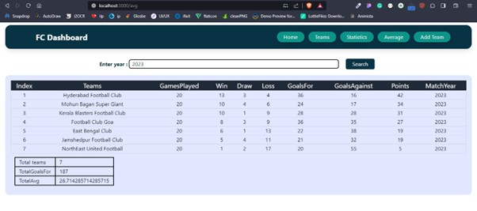

# ⚽ MERN Stack Football Application

A modern **full-stack football web application** built using the **MERN Stack (MongoDB, Express.js, React.js, Node.js)**.  
This project showcases my ability to design and develop scalable web applications with dynamic user interfaces and backend integration.

---



## 📌 Overview

This application allows users to explore football-related data through a clean and responsive interface. It demonstrates strong understanding of:

- Frontend development using React
- Backend API creation using Node & Express
- Database management with MongoDB
- Full-stack integration

---

## 🚀 Features

✨ Key functionalities of the application:

- ⚡ Fully responsive UI
- 🔄 Dynamic data rendering using React
- 📡 RESTful API integration
- 💾 MongoDB database connectivity
- 🧩 Component-based architecture
- 📱 Mobile-friendly design
- 🔍 Clean and structured UI for better user experience

---


## 🛠️ Tech Stack

### 💻 Frontend
- React.js
- HTML5
- CSS3
- Bootstrap

### ⚙️ Backend
- Node.js
- Express.js

### 🗄️ Database
- MongoDB

### 🧰 Tools & Technologies
- Git
- GitHub
- VS Code

---


## 🧠 Skills Demonstrated

This project reflects the following skills:

- Frontend UI development
- Component-based architecture
- API integration
- State management
- Backend development
- Database handling
- Problem solving
- Debugging and optimization

---
### Clone the repository

```bash
git clone https://github.com/anju515/MERN-stack-Football


